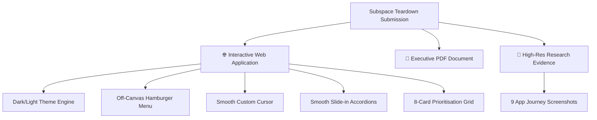

# 🚀 Subspace.money — Product Teardown
### **Candidate Submission for Product Intern Role**
**Candidate:** Subroto Datta · CTO, IETE KJSIT · B.Tech IT (AI/ML Honors) · KJSIT, Mumbai
**Date:** May 31, 2026

---

## 💎 The Submission at a Glance
This repository contains a premium, highly interactive product teardown of **Subspace.money** (India's first AI-native savings and subscription marketplace). Derived from direct app research, Play Store review mining, competitive intelligence, and industry UX benchmarks, this submission offers structural, high-impact product feedback designed to scale user trust and platform retention.



---

## 📂 Repository File Structure

| Filename | Description | Formats & Access |
| :--- | :--- | :--- |
| 🌐 **[subspace_teardown.html](file:///P:/subspace/subspace_teardown.html)** | **Interactive Presentation Web App**. Highly animated single-file HTML product teardown deck with dark/light themes, custom scrolling, cursor follow, accordion rows, and filterable priority grids. | Open directly in any modern desktop or mobile browser. Self-contained, zero-dependency. |
| 📄 **[Subspace_ProductTeardown.pdf](file:///P:/subspace/Subspace_ProductTeardown.pdf)** | **Executive Document Teardown**. Reformatted, publication-ready PDF report covering the core strategies, landscape comparison, and feedbacks. | PDF Document Viewer / Print Layout. |
| 📸 **[og_app_screenshots/](file:///P:/subspace/og_app_screenshots/)** | **Raw Research Evidence**. A curated folder containing 9 high-resolution screenshots captured across onboarding, home, explore, wallet, chat, and profile menus during active app testing. | JPEG images. |

---

## 📸 Research Evidence & Screen-to-Insight Mapping
Every recommendation in this teardown is backed by visual evidence captured directly from the Subspace Android app. Here is how the raw screenshots in `og_app_screenshots/` translate directly into the core feedbacks:

```
og_app_screenshots/
├── 📱 Home Screen.jpeg          ───► [FB 03] Premature Credit Card Upsell Timing
├── 🔍 Explore P1.jpeg           ───► [FB 02] 149+ Netflix Groups with Zero Trust Signals
├── 🔍 Explore P2.jpeg           ───► [FB 04] ChatGPT/Claude AI Tools Category Gap
├── 🔍 Explore P3.jpeg           ───► [FB 07] Exploration Discovery Friction
├── 🔍 Explore P4.jpeg           ───► [FB 07] Flat Grids & Filtering Friction
├── 💼 Wallet Screen.jpeg        ───► [FB 06] High Upfront Security Deposit Barrier
├── 💬 Chat Screen.jpeg          ───► [Observation] Anonymous Messaging in Fintech Context
├── 👤 Account P1.jpeg           ───► [FB 05] 13 Flat Account Menu Items
└── 👤 Account P2.jpeg           ───► [FB 05] KYC and Payout Setup Actions Buried
```

---

## 📋 The 8 Feedbacks at a Glance
The teardown targets structural failures that compound across the user base rather than trivial visual quirks. The prioritisation table is listed below:

| # | Pillar | Feedback Title | Impact / Category | Impact Score | Effort | Primary Target KPI |
| :-: | :--- | :--- | :--- | :-: | :--- | :--- |
| **01** | **UX** | **Identity-Free Onboarding**<br>Signup accepts phone OTP and immediately completes, calling every user "User" on their profile. | `P0 — CRITICAL`<br>⚡ Quick Win | **95/100** | **Low** (1 dot) | D30 Retention, Platform Trust |
| **02** | **Features** | **Undifferentiated Groups**<br>149+ Netflix groups listed identically with zero trust or reliability metrics. | `P1 — HIGH`<br>🎯 Strategic Bet | **80/100** | **Medium** (2 dots) | Churn Rate, Marketplace Health |
| **03** | **GTM** | **Premature Credit Card Upsell**<br>Aggressive credit card ads served to cold users within 60 seconds of onboarding. | `P1 — HIGH`<br>⚡ Quick Win | **75/100** | **Low** (1 dot) | CTA Conversion, Day-1 Uninstalls |
| **04** | **Competitor** | **AI Tools Category Gap**<br>Zero options for ChatGPT Plus, Claude, Perplexity, or Notion AI sharing. | `P2 — GROWTH`<br>🎯 Strategic Bet | **70/100** | **Medium** (2 dots) | Platform GMV, College ICP Acquisition |
| **05** | **UX** | **Account IA Information Overload**<br>13 flat menu items list critical Payout & KYC links alongside tertiary blog links. | `P2 — MEDIUM`<br>⚡ Quick Win | **60/100** | **Low** (1 dot) | KYC Completion Rate, Admin Payouts |
| **06** | **Features** | **Rental Security Deposit Barrier**<br>High upfront security deposit demands suppress active rental transactions. | `P1 — HIGH`<br>🎯 Strategic Bet | **78/100** | **Medium** (2 dots) | Rental Active Volume, Average Order Value |
| **07** | **UX** | **Exploration Discovery Friction**<br>Flat grid interfaces restrict easy product discovery and search conversions. | `P2 — GROWTH`<br>⚡ Quick Win | **68/100** | **Low** (1 dot) | Product Click-Through Rate, Drop-offs |
| **08** | **GTM** | **Flat Referral Incentive Loop**<br>Standard one-sided flat incentives limit the organic referral viral coefficient. | `P2 — MEDIUM`<br>⚡ Quick Win | **65/100** | **Low** (1 dot) | Organic User Acquisition Cost, Virality |

---

## 🎨 Interactive Design & Technical Excellence
The website `subspace_teardown.html` is custom-built with high-fidelity front-end interactions and professional presentation styling:

### 🌗 Premium Theme Variable Engine
* Seamless switching between a sleek midnight **Dark Mode** and a warm, high-contrast **Light Mode** (WCAG AAA compliant).
* **FOUC Prevention**: Injected an inline theme-check script immediately within the `<body>` tag. It blocks unstyled flashes on slow connections by loading the local storage preferences before rendering the first paint.

### 📱 Perfect Mobile Refinements (Responsive Overrides)
* **Off-Canvas Slide Menu**: Under `768px`, navigation shifts to a mobile Hamburger Menu drawer which slides in seamlessly and auto-closes when navigation links are clicked.
* **Auto-Hide Custom Cursor**: Custom follow-cursors (`#cursor-dot` and `#cursor-cross`) are disabled on devices under `1024px`, reverting to normal touchscreen cursor actions for zero-lag mobile navigation.
* **Reflow-Safe Section Paddings**: Standardised to `60px 20px` for sections and `24px 20px` for prioritisation cards on screens `< 600px` to maintain a spacious layout and eliminate horizontal scrolling.

### ⚡ Lag-Free Priority Filters
* Section 5's category buttons (`⚡ Quick Wins`, `🎯 Strategic Bets`, `🔥 High Impact`) scale and fade elements instantly.
* Added a custom CSS trigger (`transition-delay: 0s !important;`) on `.vis` states. While cards maintain a beautiful staggered entrance when scrolled into view, subsequent filter toggling operates without delay for instantaneous UI feedback.

---

## 📈 Strategic Takeaway
> **"Subspace has proven the AI-native company thesis in production—bootstrapped, highly profitable, and operated by only 3 employees with a Rs.36.5 Cr ARR. The core product works. The next phase is making it trustable at scale through progressive identity, admin reliability flywheels, and seizing the collegiate AI-sharing market before the window closes."**

---

## 📬 Contact & Portfolio Links
* **Email:** [subroto.d@somaiya.edu](mailto:subroto.d@somaiya.edu)
* **Phone:** +91 8828543890
* **LinkedIn:** [linkedin.com/in/subroto-datta-862632270](https://linkedin.com/in/subroto-datta-862632270)
* **GitHub:** [github.com/Subroto-Datta](https://github.com/Subroto-Datta)